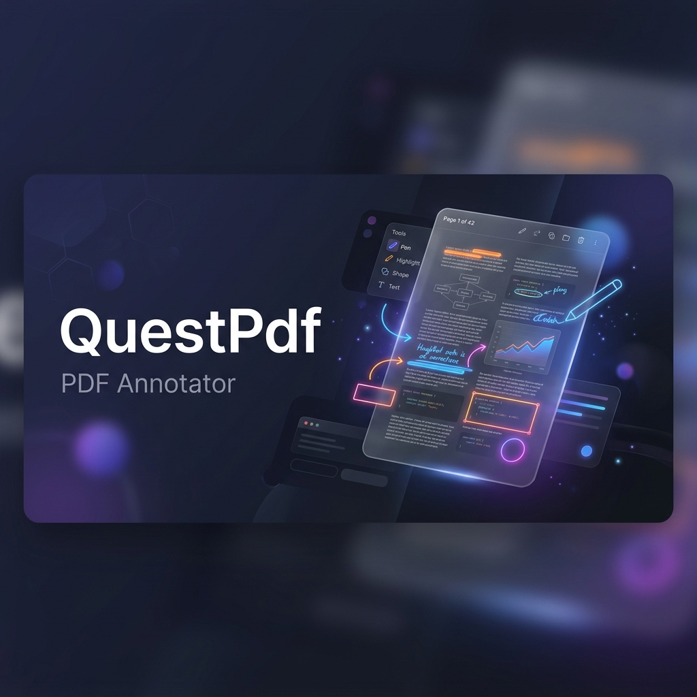

<div align="center">



<br />

# ✨ QuestPdf — Modern PDF Annotator

**A sleek, zero-dependency, client-side PDF viewer & annotator built entirely in a single HTML file.**

[](https://raza023.github.io/QuestPdfEditor/)
[](https://developer.mozilla.org/en-US/docs/Web/HTML)
[](https://developer.mozilla.org/en-US/docs/Web/CSS)
[](https://developer.mozilla.org/en-US/docs/Web/JavaScript)
[](LICENSE)

<br />

<p align="center">
  <b>No server. No dependencies. No setup.</b><br/>
  Just open <code>index.html</code> in your browser and start annotating PDFs.
</p>

---

<a href="https://raza023.github.io/QuestPdfEditor/">
  
</a>

</div>

<br />

## 🎯 What is QuestPdf?

**QuestPdf** is a premium, single-file web application that lets you **upload, view, and annotate PDF files** directly in your browser. It works 100% client-side — your files never leave your machine. Built with a stunning glassmorphic dark-mode UI, smooth animations, and full support for **English & Urdu (Nastaliq)** text annotations.

<br />

## ⚡ Features at a Glance

<table>
<tr>
<td width="50%">

### 🎨 Drawing & Markup
- ✏️ Freehand pen with adjustable thickness
- 🖌️ Smart highlighter with blend mode
- ▭ Rectangle, circle & line shapes
- 🎨 10 curated premium colors

</td>
<td width="50%">

### ✍️ Text Annotations
- 📝 Rich editable text overlays
- 🌐 English & اردو (Nastaliq) support
- 🔤 Adjustable font sizes (12–64px)
- 🎯 Drag-to-reposition text boxes

</td>
</tr>
<tr>
<td width="50%">

### 📄 PDF Navigation
- 🖼️ Thumbnail sidebar with page previews
- ⬅️➡️ Arrow key page navigation
- 🔍 Zoom in/out + fit-to-width
- 🖱️ Ctrl+Scroll wheel zoom
- ✋ Drag-to-pan document view

</td>
<td width="50%">

### 💾 Save & Export
- 💿 Ctrl+S — Direct save to file
- 📂 Ctrl+Shift+S — Save As with name
- 📥 Download compiled annotated PDF
- 🔄 Full undo/redo history per page

</td>
</tr>
</table>

<br />

## 🖥️ Tech Stack

| Technology | Purpose |
|:---|:---|
| **HTML5 / CSS3 / JS** | Core single-file architecture |
| **[PDF.js](https://mozilla.github.io/pdf.js/)** | PDF parsing & rendering |
| **[jsPDF](https://github.com/parallax/jsPDF)** | Annotated PDF compilation & export |
| **[Google Fonts](https://fonts.google.com/)** | Inter (UI) + Noto Nastaliq Urdu |
| **[Font Awesome](https://fontawesome.com/)** | Premium icon set |
| **File System Access API** | Native save/open file dialogs |

<br />

## 🚀 Quick Start

### Option 1: Live Demo (Instant)
> 👉 **[https://raza023.github.io/QuestPdfEditor/](https://raza023.github.io/QuestPdfEditor/)**

### Option 2: Run Locally

```bash
# Clone the repository
git clone https://github.com/Raza023/QuestPdfEditor.git

# Open directly in browser
start index.html        # Windows
open index.html         # macOS
xdg-open index.html     # Linux
```

> **That's it!** No `npm install`, no `pip install`, no build step. Just a single HTML file.

<br />

## ⌨️ Keyboard Shortcuts

| Shortcut | Action |
|:---|:---|
| `←` / `→` | Previous / Next page |
| `Ctrl + Z` | Undo annotation |
| `Ctrl + Y` | Redo annotation |
| `Ctrl + S` | Save PDF |
| `Ctrl + Shift + S` | Save PDF As (choose name & location) |
| `Ctrl + Scroll` | Zoom in / out |

<br />

## 🏗️ Architecture

```
QuestPdfEditor/
├── index.html       # 🎯 The entire application (HTML + CSS + JS)
├── banner.png       # 🖼️ README banner image
└── README.md        # 📖 This file
```

The entire application is **self-contained in a single `index.html` file** (~80KB). All external resources (fonts, icons, PDF.js, jsPDF) are loaded via CDN — no local dependencies needed.

### Design Philosophy

```
┌─────────────────────────────────────────────┐
│              QuestPdf Architecture           │
├─────────────────────────────────────────────┤
│                                             │
│   📄 PDF.js Layer        → PDF rendering    │
│   🎨 Canvas Layer        → Drawings/shapes  │
│   ✍️ DOM Text Layer      → Text annotations │
│   🖱️ Event Layer         → User interaction │
│                                             │
│   State Management  → Per-page annotations  │
│   History Engine    → Undo/redo stacks      │
│   Export Pipeline   → jsPDF compilation     │
│                                             │
└─────────────────────────────────────────────┘
```

<br />

## 🌙 Theme Support

QuestPdf ships with two carefully crafted themes:

| Dark Mode (Default) | Light Mode |
|:---|:---|
| Deep indigo glassmorphic panels | Clean white panels with soft shadows |
| Ambient glow animations | Subtle light gradients |
| High contrast text | Warm readable typography |

Toggle anytime with the 🌙 / ☀️ button in the header.

<br />

## 🤝 Contributing

Contributions are welcome! Feel free to:

1. 🍴 Fork the repository
2. 🌿 Create a feature branch (`git checkout -b feature/amazing-feature`)
3. 💻 Make your changes
4. ✅ Commit (`git commit -m 'Add amazing feature'`)
5. 📤 Push (`git push origin feature/amazing-feature`)
6. 🔃 Open a Pull Request

<br />

## 📜 License

This project is open source and available under the [MIT License](LICENSE).

<br />

---

<div align="center">

**Built with ❤️ by [Raza023](https://github.com/Raza023)**

<br />

<a href="https://raza023.github.io/QuestPdfEditor/">
  
</a>
&nbsp;
<a href="https://github.com/Raza023/QuestPdfEditor">
  
</a>

<br /><br />

<sub>If you found this useful, consider giving it a ⭐ on GitHub!</sub>

</div>
